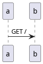

This is my notepad.

# Sample Project

## Brief

A small pizzeria serves two local villages. Following the Napoli tradition, they have a simple menu:

- Marinara
- Margherita

This sample project will help them with a digital transformation.

## Design Sprint

[Reference](https://www.gv.com/sprint/).

### Set the Stage - Checklist

- [x] Choose a big challenge
- [x] Get a decider
- [x] Recruit a sprint team
- [x] Schedule extra experts
- [x] Pick a facilitator
- [x] Block 5 days in the calendar
- [x] Book a room with two whiteboards

```
# TODO use chatgpt cli to generate calendar invitation
```

### Monday

```
# TODO
```

### Tuesday

```
# TODO
```

### Wednesday

```
# TODO
```

### Thursday

A quick and dirty prototype was created. This is built as a single HTML page, with all
logic happening client side for testing purposes only. Before the idea is validated, we do
not want to spend any time on creating a production-ready solution.

Try it out [here](/perfect_pizza_prototype).

```
function perfect_pizza_prototype {
  mkdir perfect_pizza_prototype
  (cd perfect_pizza_prototype &&
  cat << 'EOF' > index.html
<html>
  <style>
  table, th, td {
    border: 1px solid black;
    border-collapse: collapse;
  }
  </style>
  <body onload="renderPage()">
    <h1>Perfect Pizza Prototype</h1>
    <button onclick="switchRole()">Customer/Staff</button>

    <div id="order" style="display:none">
      <h2>Order</h2>
      <form id="frmOrder">
        <label>Name:</label><br><input type="text" id="frmName"><br>
        <label>Address:</label><br><input type="text" id="frmAdd"e"><br>
        <label>Items:</label><br><input type="text" id="frmItems"><br>
        <button id="btnSubmit" onclick="submitOrder()">Submit</button>
      </form>
    </div>

    <div id="manage" style="display:none">
      <h2>Manage Orders</h2>
      <table id="tblOrders" style="border: 1px solid black">
      </table>
    </div>

<script>
  if(!localStorage.getItem("curState")) {
    const defaultState = {
      role: "customer", // customer or staff
      orders: [{
        name: "Adam",
        address: "Blue Cottage, Main Street",
        items: "1x margherita",
        status: "new"
      }]
    };
    localStorage.setItem("curState", JSON.stringify(defaultState));
  }
  function submitOrder() {
    const myName = document.getElementById("frmName").value;
    const myAdd = document.getElementById("frmAdd").value;
    const myItems = document.getElementById("frmItems").value;
    let curState = JSON.parse(localStorage.getItem("curState"));
    curState.orders.push({
      name: myName,
      address: myAdd,
      items: myItems,
      status: "new"
    })
    localStorage.setItem("curState", JSON.stringify(curState));
    document.getElementById("frmName").value = "";
    document.getElementById("frmAdd").value = "";
    document.getElementById("frmItems").value = "";
    renderPage();    
  }
  function switchRole() {
    let curState = JSON.parse(localStorage.getItem("curState"));
    curState.role = ( curState.role == "customer" ? "staff" : "customer" );
    localStorage.setItem("curState", JSON.stringify(curState));
    renderPage();    
  }
  function switchStatus(name) {
    let curState = JSON.parse(localStorage.getItem("curState"));
    curState.orders.filter(x => x.name == name)[0].status = "done";
    localStorage.setItem("curState", JSON.stringify(curState));
    renderPage();    
  }

  function renderPage() {
    let curState = JSON.parse(localStorage.getItem("curState"));

    //show correct page
    document.getElementById('order').style.display = (curState.role == "customer" ? "initial" : "none");
    document.getElementById('manage').style.display = (curState.role != "customer" ? "initial" : "none");
    
    //render table content
    document.getElementById('tblOrders').innerHTML='';
    curState.orders.forEach(order => {
      const tr = document.getElementById("tblOrders").insertRow();
      tr.insertCell().appendChild(document.createTextNode(order.name));
      tr.insertCell().appendChild(document.createTextNode(order.address));
      tr.insertCell().appendChild(document.createTextNode(order.items));
      tr.insertCell().appendChild(document.createTextNode(order.status));
      if(order.status != "done") {
        const btnDone = document.createElement("button");
        btnDone.setAttribute("id", "btn" + order.name);
        btnDone.textContent = "Done";
        tr.insertCell().appendChild(btnDone);
        btnDone.addEventListener('click', (e) => {
          name = e.target.id.replace(/^btn/,"");
          switchStatus(name);
        });
      }
    })
  }
</script>
  </body>
</html>
EOF
  )
}
```

### Friday

```
# TODO
```

# Technology Choices

> TODO: The tools I will demonstrate in a reference project. Just an example structure for now.

| Tool | Prototyping/Solo | Startup/Small team | Enterprise |
|------|-----------------------|------------------|------------|
| Server Hosting | Raspberry Pi | Linode | GCP/AWS |
| Source Control | Local Git | GitLab OSS | GitHub |
| Backlog/Project Management | TODO/taskwarrior | GitLab OSS | GitHub |
| Build | `busybox sh`/`make` | platform-specific (npm, mvn) | Cloud image builds |
| Test | `busybox sh -e`/`ab` | `cucumber`/platform-specific/`wrk2` | cloud testing tools for multiple platforms and distributed load testing |
| APIs | `busybox httpd` | kong OSS | Kong Enterprise / Apigee X or Hybrid |
| Documents | txt + git | wiki | google docs |


# Development Environment

I like to keep things simple. I strive to develop expertise in a small number
of powerful, platform-agnostic open-source tools. This means that with a browser
and a terminal I have my favourite tools available and avoid vendor lock-in.

My development environment follows me. Whether using Linux, Windows and Busybox-w32,
Mac OS and Docker or Android and Termux I have what I need.

I like to start with an Alpine Linux base. I appreciate the philosophy, lightness,
simplicity and POSIX compliance of its components. For a while I was put off by
muslibc's lack of DNS over TCP, however this is resolved in newer versions.

I occasionally need to make exceptions when using tools that require glibc or have
no ARM support, however I can fallback to SSHing into a remote VM when needed.

Full applications run in Docker, K8s or a SaaS so are not included in my development 
environment.

## Installation

`curl -sSL https://seandavis.sh/raw | sh - -- install_dev_env`

```
function install_dev_env {

  cat << 'EOF' > /etc/apk/repositories
http://dl-cdn.alpinelinux.org/alpine/v3.18/main
http://dl-cdn.alpinelinux.org/alpine/v3.18/community
https://downloads.1password.com/linux/alpinelinux/stable
EOF

  wget https://downloads.1password.com/linux/keys/alpinelinux/support@1password.com-61ddfc31.rsa.pub -P /etc/apk/keys || echo "1pass key present"

  apk update
  apk add git tmux curl busybox-extras pandoc gettext openjdk17 graphviz \
    docker expect asciinema chromium chromium-chromedriver xvfb-run jq weasyprint less \
    1password-cli
  apk add kubectl --repository=http://dl-cdn.alpinelinux.org/alpine/edge/community
  apk add mdp --repository=http://dl-cdn.alpinelinux.org/alpine/edge/testing


  curl -sSL \
    "https://github.com/plantuml/plantuml/releases/download/v1.2023.11/plantuml-1.2023.11.jar" \
    -o /opt/plantuml.jar
  java -jar /opt/plantuml.jar -testdot
  curl -s https://raw.githubusercontent.com/k3d-io/k3d/main/install.sh | sh

}
```

`function install_dev_env_desktop { setup-xorg-base; apk update; apk add dwm setxkbmap; echo -e "setxkbmap gb &\nexec dwm" > .xinitrc }`

## Raspberry Pi 4 Setup

- Download aarch64 raspberry pi version on Alpine from [here](https://alpinelinux.org/downloads/)

	curl -sSLO https://dl-cdn.alpinelinux.org/alpine/v3.18/releases/aarch64/alpine-rpi-3.18.4-aarch64.tar.gz

- Insert SD card and get the name with `fdisk -l` (something like `/dev/sda`)
- In a limited environment, you can use CLI tools but I generally use `gparted` to:
  - Create new ms-dos partition table, wiping the disk
  - Create single fat32 partition on entire disk
  - Set boot flag
- Place alpine setup files
  - Mount the volume: `mount /dev/sda1 /mnt`
  - Move alpine over (assuming only one download of alpine): `cd /mnt && cp ~/Downloads/alpine-rpi*.tar.gz && tar -xvzf *tar.gz && rm alpine-rpi*.tar.gz`
  - Recommended settings: `echo -e "enable_uart=1\notg_mode=1" >> usercfg.txt`
  - Settings for overclock: `echo -e "over_voltage=6\narm_freq=2000\ngpu_freq=750" >> usercfg.txt`
  - Settings for GUI: `echo -e "disable_overscan=1\ndtoverlay=vc4-kms-v3d\nmax_framebuffers=2\ndtparam=audio=on\ncamera_auto_detect=1\ndisplay_auto_detect=1" >> usercfg.txt`
  - Settings for running k3d: `echo "cgroup_memory=1 cgroup_enable=memory" >> /boot/cmdline.txt`
  - `cd ~ && umount /mnt && sync`
- Put SD Card in RPI and boot
- `setup-alpine` interactively using sys mode
- follow steps in `install_dev_env_desktop` 


## PlantUML

Learning the syntax of plantuml has allowed me to transfer the benefits 
of in-person whiteboarding into a remote environment, and the ability
of storing the source for a diagram in version control is much easier
to manage than an presentation or UI diagramming tool.

Typically I will create mindmaps, sequence, flow and component diagrams.
For anything else, I will create a plaintext file in `vi`.

```
function demo_plantuml_seq {
  cat << 'EOF' | java -jar /opt/plantuml.jar -p > demo_plantuml_seq.png

@startuml
a->b: GET /
@enduml

EOF
}
```



```
function demo_plantuml_component {
  cat << 'EOF' | java -jar /opt/plantuml.jar -p > demo_plantuml_component.png

@startuml
cloud GCP {
  rectangle uSvc as ms
  database Database as db
  ms->db
}
@enduml

EOF
}
```


```
function demo_plantuml_flow {
  cat << 'EOF' | java -jar /opt/plantuml.jar -p > demo_plantuml_flow.png

@startuml
:step one;
if (condition?) then (result1)
  :something;
else (result2)
  :something else;
endif
:step two;
switch (condition)
case ( A )
 : a ;
case ( B )
 : b ;
case ( C )
 : c ;
endswitch
while ( loop ) is (x)
  :step three;
endwhile (y)
:step four;
split
  :step five a;
split again
  :step five b;
end split
@enduml

EOF
}
```


## Docker

Docker is the most important tool in my toolbox. With access to docker I can
spin up a lightweight development environment, run prebuilt images from docker hub,
run a headless browser, diff a container after running a process to see while files
have changed and even `rm -rf` without fear. Once software has been built in Docker,
it can then be run on many platforms including in a container orchestration platform
for production. I store all state in Dockerfile or mounted volumes, so I can regularly
clean up with `docker rm -f $(docker ps -a -q)`.

## Kubernetes

Deploying to EKS or GKE costs money. For local development there are a number of 
options. I use `k3d` as the only requirement is a docker environment and at the
time of write, `kind` doesn't play nicely with ARM [devices](https://github.com/rancher-sandbox/rancher-desktop/issues/5092).

```
function demo_k3d {
  k3d cluster create -p "8080:80@loadbalancer"

  # Useful for overwriting current kube config:
  # k3d kubeconfig write k3s-default --output ~/.kube/config

  docker ps
  kubectl cluster-info
  docker pull nginx:latest
  docker tag nginx:latest my-nginx:0.1 
  k3d image import my-nginx:0.1 # similar to publishing to a registry - note this doesn't work for :latest
  kubectl create deployment nginx --image=my-nginx:0.1
  kubectl create service clusterip nginx --tcp=80:80
  kubectl create ingress nginx --rule="/=nginx:80" 
  timeout 30 sh -c "while ! curl -f localhost:8080/; do sleep 2; done"

}
```

## Asciinema

Recording terminal sessions can be a little bit painful. When live recording,
there can be lots of typos and unnecessary pauses. When scripting, `tmux` is often
used to `send-keys` without human interaction, but given the complexity of waiting for
long running commands to complete, many people resort to random `sleep 10` commands.
`sleep`s have their place for allowing a viewer to read the screen, but not when you
have to estimate how long a command will run for.

Once the recording is complete, you also have to consider how it will be viewed. `script`
and `scriptreplay` are great locally, but a `gif` or embedded video is often desired
in a web page for normies to view.

After some experimentation, I found a sweet spot with `expect`, `asciinema` and a local
`asciinema-player` instead of pushing to their website. Thanks for the inspiration 
[Waleed](https://blog.waleedkhan.name/automating-terminal-demos/).

```

function demo_expect_asciinema {
  cat << 'EOF' | expect -f -
set timeout 5
set send_human {0.1 0.3 1 0.05 1}
spawn asciinema rec --cols 60 --rows 15 out.cast

expect "~/seandavis.sh/target #"
send -h "echo Hello, world!"; sleep 2
send "\r"
expect "Hello, World!" -timeout 1

send -h "vi"; sleep 2
send "\r"; sleep 2

send -h "ihello"; sleep 2
send -h "\x1b"; sleep 2
send -h ":q!"; sleep 2
send "\r"
send -h "exit\r\n"

EOF
}
```

<div id="democast"></div>
<script>AsciinemaPlayer.create('/out.cast', document.getElementById('democast'));</script>

```
function demo_simple_rec {
  cat << 'EOF' | expect -f -
set timeout 5
set send_human {0.1 0.3 1 0.05 1}
spawn asciinema rec --cols 60 --rows 15 simple.cast
expect -timeout 2
send -h "sh seandavis.sh install_dev_env"; sleep 2
send "\r"
expect "~/seandavis.sh/target #"

EOF
}
```
<div id="simplecast"></div>
<script>AsciinemaPlayer.create('/simple.cast', document.getElementById('simplecast'));</script>

Run a function and output the result

```
function sample_fn {
  echo "hello"
}
function run_and_record {
  cat << 'EOF' | expect -f -
set timeout 5
set send_human {0.1 0.3 1 0.05 1}
spawn asciinema rec --cols 60 --rows 15 runrec.cast

expect -timeout 2
send -h "sh seandavis.sh sample_fn"; sleep 2
send "\r"
expect -timeout 5
send -h "exit\r\n"
EOF
}
```

<div id="runrec"></div>
<script>AsciinemaPlayer.create('/runrec.cast', document.getElementById('runrec'));</script>


## Busybox

Busybox has a great core set of tools. With minimal POSIX versions of 
`vi`, `sed`, `awk`, `httpd` and `sh` you can build quite powerful solutions
for prototyping or deployment on embedded/lightweight devices. Busybox is 
also _tiny_ and comes as standard in Alpine Linux.

In a few lines, I can build a website:

```
function prototype_busybox_web {
  mkdir -p prototype_busybox_web 
  (cd prototype_busybox_web &&
    echo '<html><body><p>Hello World!</p></body></html>' > index.html &&
    httpd -p 8081 -h .
    while ! curl -f http://localhost:8081/; do sleep 1; done)
  pkill httpd
}
```

I can also build a (very limited) API:

```
function prototype_busybox_api {
  mkdir -p prototype_busybox_api
  (cd prototype_busybox_api &&
    mkdir -p cgi-bin 
    cat << 'EOF' > cgi-bin/ping
#!/bin/sh

echo "Content-Type: text/plain"
echo ""
echo "PONG!"
echo ""
POST_DATA="$(cat)"
echo "POST_DATA=$POST_DATA"
echo "QUERY_STRING=$QUERY_STRING"
echo "REQUEST_METHOD=$REQUEST_METHOD"
echo "PATH_INFO=$PATH_INFO"
printenv | grep '^HTTP'

EOF
    chmod +x cgi-bin/ping
    httpd -p 8081 -h .
    while ! curl -f http://localhost:8081/cgi-bin/ping; do sleep 1; done
  )
  pkill httpd
}

```

I can build a proxy...

```
function prototype_busybox_proxy {
  mkdir -p prototype_busybox_proxy
  (cd prototype_busybox_proxy &&
    echo 'P:/:httpbin.org/' > httpd.conf &&
    httpd -p 8081 -c httpd.conf
    while ! curl -f http://localhost:8081/get; do sleep 1; done)
  curl http://localhost:8081/get
  pkill httpd
}
```

Lets do the same for a database with an API interface that writes to a CSV file.

```
function prototype_busybox_db {
  mkdir -p prototype_busybox_db
  (cd prototype_busybox_db &&
    mkdir -p cgi-bin 
    cat << 'EOF' > cgi-bin/db
#!/bin/sh

###
# A dummy CSV flat file DB, accessed via API
#   using busybox only. No validation. Uses timestamps as ids.
#   Doesn't set content-length so requires the HTTP client to close
#   the connection. No API security.
###

POST_DATA="$(cat)"

# firstly, make sure the db exists
touch db.csv


# CREATE
if [ "$REQUEST_METHOD" = "POST" ] && [ ! $PATH_INFO ]; then
  echo "HTTP/1.1 201 Created"
  echo "Content-Type: text/plain"
  echo ""
  ID=$(date +%s%3N)
  echo "$ID,$POST_DATA" >> db.csv
  awk "/^$ID,/{ print \$0 }" db.csv
# READ ALL
elif [ "$REQUEST_METHOD" = "GET" ] && [ ! $PATH_INFO ]; then
  echo "Content-Type: text/plain"
  echo ""
  cat db.csv
# READ ONE
elif [ "$REQUEST_METHOD" = "GET" ] && [ $PATH_INFO ]; then
  echo "Content-Type: text/plain"
  echo ""
  ID=$(echo "$PATH_INFO" | sed 's/\/\(.*\)/\1/')
  echo "debug:$ID"
  awk "/^$ID/{ print \$0 }" db.csv
# UPDATE ONE
elif [ "$REQUEST_METHOD" = "PUT" ] && [ $PATH_INFO ]; then
  echo "Content-Type: text/plain"
  echo ""
  ID=$(echo "$PATH_INFO" | sed 's/\/\(.*\)/\1/')
  sed -i "/^$ID/d" db.csv
  echo "$ID,$POST_DATA" >> db.csv
  awk "/^$ID/{ print \$0 }" db.csv
# DELETE ALL
elif [ "$REQUEST_METHOD" = "DELETE" ] && [ ! $PATH_INFO ]; then
  echo "HTTP/1.1 204 No Content"
  echo "Content-Type: text/plain"
  echo ""
  rm db.csv
# DELETE ONE
elif [ "$REQUEST_METHOD" = "DELETE" ] && [ $PATH_INFO ]; then
  echo "HTTP/1.1 204 No Content"
  echo "Content-Type: text/plain"
  echo ""
  ID=$(echo "$PATH_INFO" | sed 's/\/\(.*\)/\1/')
  sed -i "/^$ID/d" db.csv
else
  echo "HTTP/1.1 400 Bad Request"
  echo "Content-Type: text/plain"
  echo ""
  echo "debug: $REQUEST_METHOD:$PATH_INFO"
  echo "Not supported"
fi
EOF
    chmod +x cgi-bin/db
    httpd -p 8081 -h .
    while ! curl -f http://localhost:8081/cgi-bin/db; do sleep 1; done
    curl -f http://localhost:8081/cgi-bin/db
    curl -f http://localhost:8081/cgi-bin/db -d 'Sean, 31'
    curl -f http://localhost:8081/cgi-bin/db -XDELETE 
  )
  pkill httpd
}
```

TLS can be provided with `stunnel`.

We can also simulate message queues and other async protocols with `mkfifo`

```
function prototype_busybox_mq {
  mkfifo myqueue
  echo "Message 1">myqueue &
  echo "Message 2">myqueue &
  sleep 2
  while read line; do echo "$line"; done<myqueue
  rm myqueue
}
```

Simple tests can be built using busybox `sh`. We set the `-e`
flag and any non-zero exit code is considered a failure. `grep -q`
is useful for validating the output.

```
function prototype_busybox_test {
  mkdir -p prototype_busybox_test
  (cd prototype_busybox_test &&
    cat << 'EOF' > test.sh
#!/bin/sh
set -e

# Successful Assertion
echo "Hello" | grep -q "Hello"

# Failed Assertion
echo "Hello" | grep -q "Goodbye"

EOF
  sh test.sh || true
  )
}
```

Simple behaviour driven tests can be built using `awk`.

```
function prototype_busybox_bdd {
  mkdir -p prototype_busybox_bdd
  (cd prototype_busybox_bdd &&
    cat << 'EOF' > Test.feature
Feature: As a mathematician I want to do addition so that I can count

  Scenario: Simple addition
    Given X is 1
    And Y is 1
    When I add X and Y
    Then result is 2
EOF
    cat << 'EOF' > test.sh
#!/bin/sh
set -e

cat Test.feature | awk '
{ isDefined=0; exitCode=0 }
/Feature|Scenario|^#|^$/ { isDefined=1 }
/(Given|And) .* is .*/ {
  isDefined=1
  vars[$2] = $4
}
/When I add .* and .*/ {
  isDefined=1
  result = vars[$4] + vars[$6]
}
/Then result is .*/ {
  isDefined=1
  print "comparing "result" and "$4
  if(result != $4) {
    print "Result is not "$4
    exitCode=1
  } 
}
{ if(!isDefined) { print $0 " is not defined";exitCode = 1 } }
END { print (exitCode==0)? "Tests Succeeded" : "Tests Failed";exit exitCode }
'
EOF
  sh test.sh)
}
```

Sometimes, we need to call external tools from `awk` and capture their output and exit code.

```
function prototype_busybox_awk_exit {
  awk 'BEGIN {
       cmd = "date"
       res = cmd | getline mydate
       print mydate
       print (res!=0)? "Success" : "Fail"
       close(cmd)
     }'
}
```

## Curl

With the rise of APIs in the global consciousness, the HTTP client space has
exploded. From UI tools like Postman, Insomnia and Paw to CLIs like `httpie` and
`hurl`, it can be overwhelming to choose. Let's keep it simple and stick to the
universal HTTP client. It's installed by default on many systems and its creator,
[Daniel Stenberg](https://daniel.haxx.se/) is a great role model for maintaining
and open source project.

## Pandoc

I believe that plain text files are the best way of record, sharing and 
evolving information - however not everybody likes reading it. By using
pandoc, I can generate websites (such as this one), word, powerpoint and pdf docs.

When generating documents for work, they may need styling to fit brand guidelines.
I find the latex syntax unintuitative and prefer to use `weasyprint` and `css` to
easily change fonts, colours and other styles. This requires python which is a bit
heavy, so I try to avoid the need to style my docs where possible.

```
function demo_pandoc_pdf {
  curl -sSL -o rs-fonts.zip https://github.com/RuneStar/fonts/releases/download/1.103-0/RuneScape-Fonts.zip
  (mkdir -p rs-fonts && cd rs-fonts && unzip ../rs-fonts.zip) 
  cat << 'EOF' > rs.css
@font-face {
  font-family: "Runescape Plain 12";
  src: url(rs-fonts/ttf/RuneScape-Plain-12.ttf);
}
@page {
    @top-right{
        content: "Page " counter(page) " of " counter(pages);
    }
}
* {
    font-family: "Runescape Plain 12";
}
h1 {
  color: red;
}

EOF
  cat << 'EOF' | pandoc --metadata title="" -s -c rs.css --pdf-engine weasyprint -o sample.html

# Hello World

Some text here
EOF
  pandoc --metadata title="" -s -c rs.css --pdf-engine weasyprint sample.html -o sample.pdf
}
```

<embed src="sample.pdf" type="application/pdf" width="100%" height="600px" />

## Git

Needs no explanation.

## Tmux

Tabs in the terminal. Set a nice colour scheme and title using:

```
function style_tmux {
  cat << 'EOF' > $HOME/.tmux.conf
set -g status-bg red
set -g status-right Ferrari
set -g status-left ""
EOF
}
```
<div id="styletmuxcast"></div>
<script>AsciinemaPlayer.create('/style_tmux.cast', document.getElementById('styletmuxcast'));</script>

## MDP

Markdown presentation viewer in the terminal. Using this tool makes presentations
standout compared with powerpoints and it is really quick to use.

<div id="mdpcast"></div>
<script>AsciinemaPlayer.create('/mdp.cast', document.getElementById('mdpcast'));</script>

## Headless Chrome

I talked about how great `docker` and `curl` are earlier. Why not install Chrome
in docker, add `chromedriver` to allow automation via API for web testing?

I am inspired by [Shellnium](https://github.com/Rasukarusan/shellnium), but want to 
use busybox POSIX `sh` instead of `bash`.

```
function demo_headless_chrome_curl {
  xvfb-run chromedriver --disable-dev-shm-usage --disable-gpu --no-sandbox --disable-setuid-sandbox &
  timeout 10 sh -c "while ! curl -f localhost:9515/status; do sleep 2; done"
  SESSION_ID=$(curl localhost:9515/session -d '{
    "desiredCapabilities": {
      "browserName": "chromium",
      "chromeOptions": {
        "args": ["--no-sandbox", "--headless"]
      }
    }
  }'| jq -r '.sessionId')
  
  sleep 2
  curl -s localhost:9515/session/$SESSION_ID/url -d '{"url":"https://example.com/"}' >/dev/null
  sleep 2
  curl localhost:9515/session/$SESSION_ID/screenshot | jq -r '.value' | base64 -d > last-screenshot.png
}
```


## 1Password

This demo of course uses a dummy account

```
function demo_onepassword {
  op --version
  exit # Only run this locally, as I don't want to store my secrets in GH
  cat << 'EOF' | expect -f -
set timeout 5
set send_human {0.1 0.3 1 0.05 1}
spawn asciinema rec --cols 60 --rows 15 onepass-demo.cast

expect -timeout 2
send -h "op vault ls"; sleep 2; send "\r"
expect -timeout 5 "Do you want to add an account manually now? [Y/n]"
send -h "Y"; sleep 2; send "\r"
expect -timeout 5 "Enter your sign-in address (example.1password.com):"
send -h "my.1password.eu"; sleep 2; send "\r"
expect -timeout 5 "Enter the email address for your account on my.1password.eu:"
send -h "xxx"; sleep 2; send "\r"
expect -timeout 5 "Enter the Secret Key for xxx on my.1password.eu:"
send -h "xxx"; sleep 2; send "\r"
expect -timeout 5 "Enter the password for xxx on my.1password.eu:"
send -h "xxx"; sleep 2; send "\r"
expect -timeout 5 
send -h "eval $(op signin)"; sleep 2; send "\r"
expect -timeout 5 
send -h "op vault ls"; sleep 2; send "\r"
expect -timeout 5 
send -h "op vault create testvault"; sleep 2; send "\r"
expect -timeout 5 
send -h "op item create --vault testvault --category login --title 'testitem' 'username=test@example.com' 'password=HelloWorld'; sleep 2; send "\r'
expect -timeout 5 
send -h "op item get testitem"; sleep 2; send "\r"
expect -timeout 5 
send -h "op item get testitem --fields label=password"; sleep 2; send "\r"
expect -timeout 5 
send -h "op vault delete testvault"; sleep 2; send "\r"
expect -timeout 5 
send -h "exit\r\n"
EOF
}
```

<div id="opcast"></div>
<script>AsciinemaPlayer.create('/onepass-demo.cast', document.getElementById('opcast'));</script>

## ChatGPT 

<platform.openai.com>

```
function demo_chatgpt {
  exit
  curl https://api.openai.com/v1/chat/completions   -H "Content-Type: application/json"   -H "Authorization: Bearer $OPENAI_API_KEY"   -d '{
    "model": "gpt-3.5-turbo",
    "messages": [
      {
        "role": "system",
        "content": "You are a poetic assistant, skilled in explaining complex programming concepts with creative flair."
      },
      {
        "role": "user",
        "content": "Compose a poem that explains the concept of recursion in programming."
      }
    ]
  }'
}
```

## Presentation Scripting

I would love to be able to generate presentation videos from my terminal.

This would involve:

- Scripting of demos, as shown with `expect` and `asciinema` above
- Styling this output and converting to a video format
- Generation of audio using a TTS model that has been trained with my voice
- Merging the video and audio at the correct timestamps

```
function demo_scriptpresent {
  export PS1="$ "
  cat << 'EOF' | expect -f -
set timeout 5
set send_human {0.1 0.3 1 0.05 1}
spawn asciinema rec --cols 60 --rows 15 --env=SHELL,TERM,PS1 scriptpresent-demo.cast

expect "$ "
send "vi whiteboard\r"; sleep 2; send "i"
expect -timeout 2
send -h -- "# Hello World\n\n"; sleep 2
send -h -- "- Hello\n"; sleep 2
send -h -- "- World"; sleep 2
send "\003"
send ":q!\r"
send "exit\r"
EOF
  echo "TODO"
  # generate script for demo
  # convert demo to gif - agg
  # generate audio with my voice - piper tts is an option
  # merge
}
```
<div id="scriptpresentcast"></div>
<script>AsciinemaPlayer.create('/scriptpresent-demo.cast', document.getElementById('scriptpresentcast'));</script>


# Programming Challenges

## Project Euler

Where possible, I solve these with busybox only. For more complex
performance requirements, I choose a more suitable tool.

Problem 1

```
function euler_1 {
  seq 999 | awk '{ if ($0 % 3 == 0 || $0 % 5 == 0) { sum+=$0}} END { print sum }'
}
```

Problem 2

```
function euler_2 {
  curl -sSL https://raw.githubusercontent.com/yousefvand/fibonacci/master/sequence.txt | \
    sed 's/^1, //' fib.txt | tr ',' '\n' | \
    awk '{ if ($0 < 4000000 && $0 % 2 == 0) {sum+=$0}} END {print sum}'
}
```

Problem 3

```
function euler_3 {
  factor 600851475143 | sed 's/.* \(.*\)$/\1/'
}
```

Problem 4

```
function euler_4 {
  echo 3 | awk 'BEGIN{ 
    max = (10 ^ $0)
    highest = 0
    for (i = 1; i < max; i++) {
      for (j = 1; j < max; j++) {
        # calculate product
        product = i*j

        # reverse string
        rev=""
        for(k=length(product);k!=0;k--) {
          rev=(rev substr(product,k,1))
        }

        # store highest
        if(product == rev && product > highest) {
          highest = product
        }
      }
    }
    print highest
  }'
}
```

Problem 5

```
function euler_5 {
  exit # skip in pipeline until optimised
  echo 20 | awk '{
    for (i = $0; 1; i++) {
      evenlydivisible = 0
      for (j = 1; j <= $0; j++) {
        if(i % j != 0) evenlydivisible = 1
      }
      if(evenlydivisible == 0) {
        print i
        exit
      }
    }
  }'
}
```

Problem 6
```
function euler_6 {
  echo 100 | awk '{
    sumOfSquares = 0
    for(i = 1; i <= $0; i++) {
      sumOfSquares+=i^2
    }
    squareOfSum = 0
    for (i = 1; i <= $0; i++) {
      squareOfSum+=i
    }
    squareOfSum=squareOfSum^2
    print squareOfSum - sumOfSquares
  }'
}
```
Problem 7
```
function euler_7 {
  c=0
  i=2
  target=10001
  while true; do
    exit # skip in pipeline until optimised
    if [ $(factor $i | wc -w) = 2 ]; then
      c=$((c+1))
    fi
    if [ $c = $target ]; then echo $i; exit; fi
    i=$((i+1))
  done
}
```

# OSRS Leagues 4 Theorycrafting

With [this](https://www.reddit.com/r/2007scape/comments/j7i4te/trailblazer_league_an_extensive_overview_of_every/?rdt=37070) and OSRS wiki.

BIS:


# Contact

